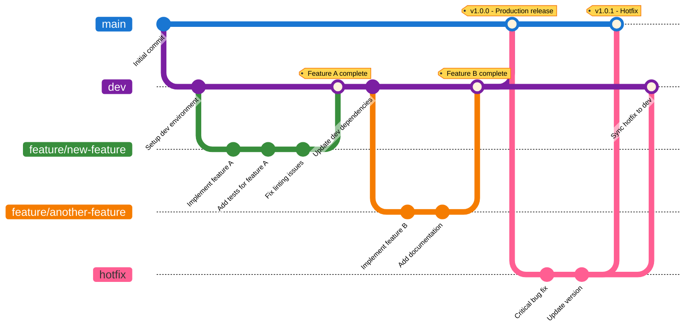
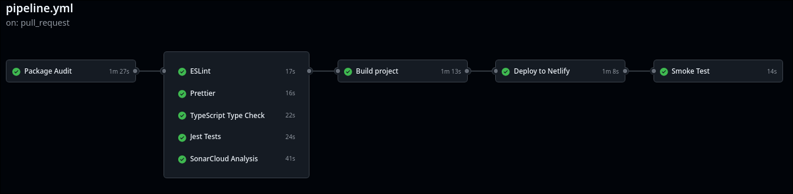
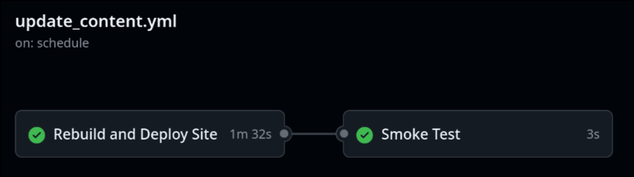
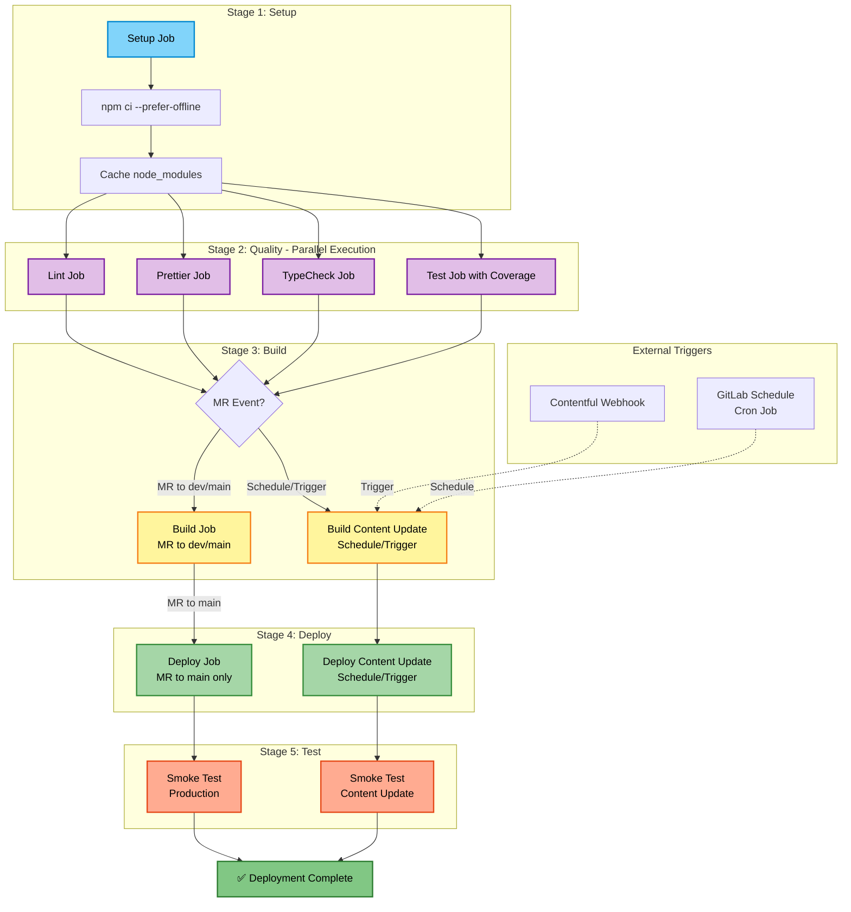

# TDW 1st Mini-Project

[](https://github.com/Dan1m4D/tdw-mp1-daniel-madureira/actions/workflows/pipeline.yml)
[](https://gitlab.com/Dan1m4D/tdw-mp1-daniel-madureira/-/commits/main)


[](https://sonarcloud.io/summary/new_code?id=Dan1m4D_tdw-mp1-daniel-madureira)

The objective of this first mini-project is to develop a CI/CD pipeline over a Next blog that consumes contents from Contentful CMS. The blog looks like the follow:


The project is organized as follows:

```bash
.
├── .github/
│   └── workflows/
│       ├── pipeline.yml           # Main CI/CD pipeline
│       └── update_content.yml     # Content update workflow
├── .gitlab-ci.yml                 # GitLab CI/CD pipeline
├── app/
│   └── [app files]
├── coverage/
│   └── coverage-summary.json
├── lib/
│   └── [lib files]
├── out/                           # Next.js static export output
│   └── [output files]
├── __tests__/
│   ├── components/
│   ├── integration/
│   ├── pages/
│   ├── snapshots/
│   └── test-jest.test.tsx
├── readme_assets/
│   └── [readme images]
├── env.example
├── eslint.config.mjs
├── jest.config.ts
├── jest.setup.ts
├── lefthook.yml                   # Git hooks configuration
├── netlify.toml                   # Netlify deployment config
├── next.config.js
├── next-env.d.ts
├── package.json
├── package-lock.json
├── postcss.config.js
├── README.md
├── sonar-project.properties       # SonarCloud configuration
├── tailwind.config.ts
├── tsconfig.json
└── tsconfig.tsbuildinfo
```

## Branches and Branch Protection

This project uses a **modified GitFlow** organization with strict branch protection rules to ensure code quality and security.

### Branch Structure

- **`main`**: Production branch, heavily protected. Contains only released, production-ready code.
- **`dev`**: Development branch, protected. Contains tested and validated code ready for the next release.
- **`hotfix`**: Emergency fix branch. Used to quickly patch critical issues in `main` or `dev` without going through the full feature development cycle.
- **`feature/**`**: Feature branches. Used to develop new features or enhancements that are merged into `dev` once completed and tested.

### GitHub Branch Protection Rules

Both `main` and `dev` branches are protected with the following rules:

| Protection Rule            | Description                               | Purpose                                                                      |
| -------------------------- | ----------------------------------------- | ---------------------------------------------------------------------------- |
| **No Direct Pushes**       | All changes must go through Pull Requests | Ensures code review and CI/CD validation                                     |
| **No Force Pushes**        | Cannot rewrite branch history             | Preserves commit history and prevents accidental overwrites                  |
| **Require Signed Commits** | All commits must be GPG/SSH signed        | Verifies commit authenticity and prevents impersonation                      |
| **Status Checks Required** | All CI/CD tests must pass before merge    | Ensures code quality, tests, linting, and type checking pass                 |
| **Coverage Reporting**     | Coverage reports shown in PR comments     | Provides visibility into test coverage changes                               |
| **GitHub Copilot Review**  | Automated code review from Copilot        | Catches potential issues, suggests improvements, and enforces best practices |

| Main rules                                                                                  | Dev rules                                                                               |
| ------------------------------------------------------------------------------------------- | --------------------------------------------------------------------------------------- |
|   |   |

### Why the Hotfix Branch Exists

Since direct pushes to `main` and `dev` are blocked, the `hotfix` branch serves as a quick-response mechanism:

1. Create `hotfix` branch from `main` (or `dev`)
2. Make critical fix with proper commits
3. Open PR to `main` (bypassing normal feature → dev → main flow)
4. After merge to `main`, also merge back to `dev` to keep branches in sync

This ensures even emergency fixes go through proper CI/CD validation while allowing faster deployment than the full feature workflow.

### Branch Flow Diagram

The general workflow can be summarized by the following diagram:



## Pipeline overview

[](https://github.com/Dan1m4D/tdw-mp1-daniel-madureira/actions/workflows/pipeline.yml)
[](https://gitlab.com/Dan1m4D/tdw-mp1-daniel-madureira/-/commits/main)

The CI/CD pipeline is implemented on **both GitHub Actions and GitLab CI/CD** following industry best practices for performance, reliability, and efficiency.

### Platform Comparison

Both platforms implement identical pipeline logic with platform-specific optimizations for performance and reliability:

| Feature                 | GitHub Actions                       | GitLab CI/CD                                                |
| ----------------------- | ------------------------------------ | ----------------------------------------------------------- |
| **Pipeline Config**     | `.github/workflows/**`               | `.gitlab-ci.yml`                                            |
| **Stages**              | Jobs run in parallel/sequence        | 5 explicit stages: setup → quality → build → deploy → test  |
| **Caching**             | `actions/cache` + setup-node         | Native GitLab cache with push/pull policies                 |
| **Environments**        | GitHub Environments (dev/production) | Not available in free tier (uses conditional rules instead) |
| **Deployment**          | GitHub Actions + Netlify             | GitLab CI + Netlify CLI                                     |
| **Scheduled Pipelines** | Cron syntax in workflow file         | Pipeline Schedules UI with cron expressions                 |
| **Artifacts**           | Automatic retention                  | Configurable expiration (1 day default)                     |
| **Secrets Management**  | GitHub Secrets                       | GitLab CI/CD Variables                                      |
| **Parallelization**     | Matrix strategy + needs dependencies | Stage-based with parallel jobs                              |

### Lefthook: Local Git Hooks

Before code even reaches the remote CI/CD pipelines, Lefthook runs quality checks locally via Git hooks. This provides immediate feedback during development and catches issues before they're pushed.

#### Configuration

**Pre-commit hooks** (run before each commit):

- **ESLint**: Lints only staged files (`*.js`, `*.ts`, `*.jsx`, `*.tsx`)
- **Prettier**: Auto-formats code to ensure consistent style
- **Jest**: Runs tests with coverage only for changed test files

**Pre-push hooks** (run before pushing to remote):

- **npm audit**: Checks for dependency vulnerabilities (moderate level and above)

This creates a **defense-in-depth quality strategy**:

```
Local (Lefthook) → Remote (GitHub/GitLab) → Deployment (Netlify)
```

### Pipeline Workflow Diagram

The following diagram shows the complete flow from local development to production deployment, including Lefthook integration:

```mermaid
graph LR
  A[Local Commit] --> L[Lefthook Pre-commit]
  L --> L1[ESLint on staged files]
  L --> L2[Prettier format]
  L --> L3[Jest on changed tests]
  L1 --> B[Push to Remote]
  L2 --> B
  L3 --> B
  B --> L4[Lefthook Pre-push]
  L4 --> L5[npm audit security check]
  L5 --> C[GitHub Actions / GitLab CI]
  C --> PV[Package Audit]
  PV --> D[ESLint Job]
  PV --> E[Prettier Job]
  PV --> TC[TypeCheck Job]
  PV --> F[Test Job with Coverage]
  PV --> SC[SonarCloud Job]
  D --> G{PR/MR to main/dev?}
  E --> G
  TC --> G
  F --> G
  SC --> G
  G -->|Yes| H[Build Job]
  G -->|No| END[End]
  H -->|PR/MR to main?| I[Deploy Job]
  H -->|PR/MR to dev?| END
  I --> I2[Deploy to Netlify]
  I2 --> ST[Smoke Test]
  J[Contentful CMS Update] --> K[Content Update Webhook]
  K --> K1[Rebuild Site]
  K1 --> I2
  M[Scheduled Job: Trigger/Schedule] --> K1

  style A fill:#BBDEFB,stroke:#1976D2,stroke-width:2px,color:#000
  style L fill:#E1BEE7,stroke:#7B1FA2,stroke-width:2px,color:#000
  style L1 fill:#E1BEE7,stroke:#7B1FA2,stroke-width:2px,color:#000
  style L2 fill:#E1BEE7,stroke:#7B1FA2,stroke-width:2px,color:#000
  style L3 fill:#E1BEE7,stroke:#7B1FA2,stroke-width:2px,color:#000
  style B fill:#BBDEFB,stroke:#1976D2,stroke-width:2px,color:#000
  style L4 fill:#E1BEE7,stroke:#7B1FA2,stroke-width:2px,color:#000
  style L5 fill:#E1BEE7,stroke:#7B1FA2,stroke-width:2px,color:#000
  style C fill:#81D4FA,stroke:#0288D1,stroke-width:2px,color:#000
  style PV fill:#FFE082,stroke:#FFA000,stroke-width:2px,color:#000
  style D fill:#E1BEE7,stroke:#7B1FA2,stroke-width:2px,color:#000
  style E fill:#E1BEE7,stroke:#7B1FA2,stroke-width:2px,color:#000
  style TC fill:#E1BEE7,stroke:#7B1FA2,stroke-width:2px,color:#000
  style F fill:#E1BEE7,stroke:#7B1FA2,stroke-width:2px,color:#000
  style SC fill:#C5CAE9,stroke:#3F51B5,stroke-width:2px,color:#000
  style G fill:#FFF59D,stroke:#F57F17,stroke-width:2px,color:#000
  style H fill:#FFF59D,stroke:#F57F17,stroke-width:2px,color:#000
  style I fill:#A5D6A7,stroke:#388E3C,stroke-width:2px,color:#000
  style I2 fill:#A5D6A7,stroke:#388E3C,stroke-width:2px,color:#000
  style ST fill:#FFAB91,stroke:#E64A19,stroke-width:2px,color:#000
  style J fill:#F8BBD0,stroke:#C2185B,stroke-width:2px,color:#000
  style K fill:#F8BBD0,stroke:#C2185B,stroke-width:2px,color:#000
  style K1 fill:#FFF59D,stroke:#F57F17,stroke-width:2px,color:#000
  style M fill:#E1BEE7,stroke:#7B1FA2,stroke-width:2px,color:#000
  style END fill:#B0BEC5,stroke:#455A64,stroke-width:2px,color:#000
```



### GitHub Actions Pipeline

The GitHub Actions implementation uses two workflow files to handle different triggers and use cases.

#### 1. **Main CI/CD Pipeline** (`pipeline.yml`)

Main development and deployment workflow triggered by pushes and pull requests.

| Job           | Description                                              | When                   | Timeout |
| ------------- | -------------------------------------------------------- | ---------------------- | ------- |
| Package Audit | Runs `npm audit` to check for dependency vulnerabilities | All pushes & PRs       | 5 min   |
| ESLint        | Lints code for errors and style violations               | All pushes & PRs       | 10 min  |
| Prettier      | Checks code formatting                                   | All pushes & PRs       | 10 min  |
| TypeCheck     | Validates TypeScript types with `tsc --noEmit`           | All pushes & PRs       | 10 min  |
| Test          | Runs Jest test suite with coverage                       | All pushes & PRs       | 10 min  |
| SonarCloud    | Analyzes code quality and security                       | All pushes & PRs       | 10 min  |
| Build         | Validates Next.js build process                          | PRs to `main` or `dev` | 15 min  |
| Deploy        | Deploys to Netlify production                            | PRs to `main`          | 15 min  |
| Smoke Test    | Verifies deployment is live and accessible               | After deployment       | 5 min   |

**Key Features:**

- Quality jobs run in parallel after Package Audit passes
- Uses GitHub Environments (development/production) for environment-specific configuration
- Implements `actions/setup-node` with automatic npm caching
- Uses `.next/cache` caching for faster builds (production only)
- Automatic concurrency cancellation (cancels old runs when new commits are pushed)
- Test coverage reporting posted as PR comments



#### 2. **Content Update Workflow** (`update_content.yml`)

Handles automatic site rebuilds triggered by Contentful CMS updates or scheduled jobs.

| Trigger                | Description                                               | Actions                          |
| ---------------------- | --------------------------------------------------------- | -------------------------------- |
| **Contentful Webhook** | Triggered when content is published/updated in Contentful | Rebuild site → Deploy to Netlify |
| **Scheduled Cron Job** | Runs daily at midnight UTC (`0 0 * * *`)                  | Rebuild site → Deploy to Netlify |

**Key Features:**

- **Immediate updates**: Content changes go live automatically without developer intervention
- **Scheduled rebuilds**: Daily rebuilds ensure content freshness and catch missed webhook events
- **Decoupled workflow**: Separate from main CI/CD pipeline to avoid unnecessary test runs



### GitLab CI/CD Pipeline

The GitLab pipeline was designed to replicate the GitHub Actions workflow while leveraging GitLab-specific features for optimization. It uses a **5-stage architecture** with explicit dependency management and caching.

#### Pipeline Architecture

```
setup → quality (parallel) → build → deploy → test
```

The pipeline is organized into distinct stages where jobs in the same stage run in parallel, and each stage waits for the previous one to complete before starting.

#### GitLab Pipeline Workflow Diagram



#### Pipeline Jobs and Structure

| Stage       | Jobs                                      | Description                                          | Parallelization                      |
| ----------- | ----------------------------------------- | ---------------------------------------------------- | ------------------------------------ |
| **setup**   | `setup`                                   | Install dependencies once, create cache for all jobs | Single job                           |
| **quality** | `lint`, `prettier`, `typecheck`, `test`   | All quality checks run simultaneously                | 4 parallel jobs                      |
| **build**   | `build`, `build-content-update`           | Build Next.js application                            | Conditional based on trigger         |
| **deploy**  | `deploy`, `deploy-content-update`         | Deploy to Netlify production                         | Conditional (only for `main` merges) |
| **test**    | `smoke-test`, `smoke-test-content-update` | Post-deployment verification                         | Conditional after successful deploy  |


#### How GitLab Replicates GitHub Actions

To match the GitHub Actions workflow functionality while working within GitLab Free tier limitations, several adaptations were made:

**1. Environment Variables Instead of Environments**

- GitHub uses "Environments" (development/production) with scoped secrets
- GitLab Free doesn't support environment scoping
- Variables are defined once in GitLab Settings → CI/CD → Variables and accessed by all jobs

**2. Stage-Based Parallelization**

- GitHub uses `needs:` dependencies to control job order
- GitLab uses explicit `stages:` with jobs in the same stage running in parallel

**3. Optimized Caching Strategy**

- GitHub: `actions/setup-node` handles caching automatically
- GitLab: Manual cache configuration with `policy: pull/push`
- **Setup job**: `policy: push` (creates cache)
- **All other jobs**: `policy: pull` (reads from cache, no npm install needed)

**4. Multi-Cache Configuration**

```yaml
cache:
  - key: node-modules-$CI_COMMIT_REF_SLUG # Branch-specific node_modules
  - key: next-cache-$CI_COMMIT_REF_SLUG # Branch-specific Next.js build cache
```

- Separates dependency cache from build cache
- Prevents cache conflicts between branches
- 30-50% faster builds with warm cache

**5. Content Update Triggers**

- GitHub: Separate workflow file (`update_content.yml`) with webhook and schedule triggers
- GitLab: Same pipeline, different jobs triggered by `$CI_PIPELINE_SOURCE`
  - `schedule`: GitLab Schedule (cron job)
  - `trigger`: Contentful webhook via GitLab Pipeline Triggers API

**6. Conditional Job Execution**
All jobs use GitLab `rules:` to replicate GitHub's `if:` conditions:

| GitHub Condition                      | GitLab Equivalent                                    | Purpose                   |
| ------------------------------------- | ---------------------------------------------------- | ------------------------- |
| `github.event_name == 'pull_request'` | `if: $CI_PIPELINE_SOURCE == "merge_request_event"`   | Run only on MRs           |
| `github.base_ref == 'main'`           | `if: $CI_MERGE_REQUEST_TARGET_BRANCH_NAME == "main"` | Deploy only to production |
| `github.event_name == 'schedule'`     | `if: $CI_PIPELINE_SOURCE == "schedule"`              | Scheduled rebuilds        |

#### Key GitLab-Specific Features

**1. Single Dependency Install**

- Only `setup` job runs `npm ci --prefer-offline`
- All other jobs pull cached `node_modules`
- Traditional approach: Every job runs npm install (~30s × 8 jobs = 4 minutes wasted)
- Optimized approach: Install once, reuse everywhere (~30s total)

**2. Interruptible Pipelines**

```yaml
default:
  interruptible: true
```

- Automatically cancels running pipelines when new commits are pushed
- Saves CI minutes and prevents queue buildup
- Matches GitHub's **concurrency cancellation** behavior

**3. Missing code quality analysis**

- The SonarCloud code analysis job in Github Action wasn't replicated due to constrains in linking the 2 repositories to the same project

### Platform-Specific Optimizations

Both platforms implement performance optimizations tailored to their specific capabilities:

#### GitHub Actions Optimizations

1. **Built-in npm Caching**
   - `actions/setup-node@v4` with automatic cache detection
   - Caches based on `package-lock.json` hash
   - ~50-70% faster dependency installs on cache hits

2. **Next.js Build Cache** (Production Only)
   - Caches `.next/cache` directory
   - Uses commit SHA as cache key for instant lookups
   - ~30-50% faster builds
   - Only enabled for PRs to `main` to catch issues early in dev builds

3. **Concurrency Control**

   ```yaml
   concurrency:
     group: ${{ github.workflow }}-${{ github.ref }}
     cancel-in-progress: true
   ```

   - Cancels outdated pipeline runs automatically
   - Saves CI minutes and reduces queue times

4. **Environment-Based Configuration**
   - Development environment: Fresh builds, no caching
   - Production environment: Full caching and optimization
   - Ensures development catches dependency and cache-related issues

#### GitLab CI/CD Optimizations

1. **Multi-Stage Cache Strategy**

   ```yaml
   cache:
     - key: node-$CI_COMMIT_REF_SLUG # Dependencies
     - key: next-$CI_COMMIT_REF_SLUG # Build cache
   ```

   - Separate caches for dependencies and builds
   - Per-branch caching prevents conflicts
   - Push/pull policies minimize cache writes

2. **Single Setup Job Pattern**
   - Install dependencies once in dedicated `setup` stage
   - All subsequent jobs pull from cache (policy: pull)
   - Eliminates redundant `npm ci` across 8+ jobs
   - Saves ~2-3 minutes per pipeline run

3. **Interruptible Pipelines**
   - Global default setting cancels stale pipelines
   - Prevents resource waste on abandoned MRs
   - Matches GitHub's concurrency cancellation

4. **Explicit Stage Parallelization**
   - Quality stage runs 4 jobs simultaneously (lint, prettier, typecheck, test)
   - Total stage time = slowest individual job
   - Sequential execution would take 10-15 minutes; parallel takes 3-5 minutes

### Quality Gates

Both platforms enforce identical quality gates before allowing deployment:

#### **Package Audit (Security Gate)**

- **First gate**: Runs before all other quality checks (GitHub) or in the setup (GitLab setup stage)
- Executes `npm audit --audit-level=moderate` to detect dependency vulnerabilities
- Blocks the pipeline if moderate or higher severity vulnerabilities are found
- Uses clean install (`npm ci`) to ensure lock file consistency

#### **Code Quality Checks (Parallel Execution)**

All quality checks run simultaneously to minimize pipeline time:

- **ESLint**: Lints code for errors, style violations, and potential bugs
- **Prettier**: Validates code formatting consistency
- **TypeScript**: Runs `tsc --noEmit` to catch type errors before runtime
- **Jest**: Runs full test suite with coverage reporting

#### **SonarCloud Code Analysis**

- Comprehensive static analysis for code quality and security
- Detects bugs, code smells, security vulnerabilities, and technical debt
- Tracks code coverage trends over time
- Posts detailed analysis as PR/MR comments
- Quality gate must pass before deployment

#### **Smoke Testing (Post-Deployment)**

- Automated verification after deployment completes
- Checks if site returns HTTP 200 status
- Validates homepage loads correctly
- Verifies expected content is present
- Fails pipeline if deployment is broken

These gates ensure that only high-quality, type-safe, secure, and verified code reaches production.

### Test Coverage Reporting

Both platforms include automatic coverage reporting on pull/merge requests:

- Generates coverage summary using Jest
- Posts coverage report as PR/MR comment (GitHub only - via `romeovs/lcov-reporter-action`)
- Includes badges, metrics, and file-level coverage details
- Only runs on PRs/MRs to avoid unnecessary comments

### Pipeline Conditions and Triggers

Both pipelines use conditional execution to optimize CI/CD resource usage:

| Condition                | GitHub Actions                                               | GitLab CI/CD                                                  | Jobs Affected                                    |
| ------------------------ | ------------------------------------------------------------ | ------------------------------------------------------------- | ------------------------------------------------ |
| **All pushes/commits**   | `on: [push, pull_request]`                                   | `if: $CI_PIPELINE_SOURCE =~ /merge_request\|push/`            | Quality checks (lint, prettier, typecheck, test) |
| **PR/MR to any branch**  | `if: github.event_name == 'pull_request'`                    | `if: $CI_PIPELINE_SOURCE == "merge_request_event"`            | Package Audit, SonarCloud                        |
| **PR/MR to dev or main** | `if: contains(fromJSON('["main", "dev"]'), github.base_ref)` | `if: $CI_MERGE_REQUEST_TARGET_BRANCH_NAME =~ /^(main\|dev)$/` | Build job                                        |
| **PR/MR to main only**   | `if: github.base_ref == 'main'`                              | `if: $CI_MERGE_REQUEST_TARGET_BRANCH_NAME == "main"`          | Deploy, Smoke Test                               |
| **Contentful webhook**   | `on: repository_dispatch`                                    | `if: $CI_PIPELINE_SOURCE == "trigger"`                        | Content update jobs                              |
| **Scheduled job**        | `on: schedule: '0 0 * * *'`                                  | `if: $CI_PIPELINE_SOURCE == "schedule"`                       | Content update jobs                              |

### Environment Strategy

**GitHub Actions:**

- Uses GitHub Environments (development/production)
- Development: PRs to `dev` - runs build validation, no deployment
- Production: PRs to `main` - full build with caching, deploys to Netlify
- Environment-specific secrets and variables

**GitLab CI/CD:**

- Uses conditional `rules:` (no environments in Free tier)
- Build job runs for MRs to both `dev` and `main`
- Deploy job runs only for MRs to `main`
- Variables defined globally in GitLab

## Contentful configuration

The configuration setup for the **Contentful integration** with this project can be found in the original readme on the [original repository](https://github.com/TDW-2025/MP1) and the **demo** can be found [here](https://github.com/deca-ua/mp1-template-david/)

## Testing


### Overview

This project includes a comprehensive test suite built with Jest and React Testing Library, covering **34 tests** across **12 test suites**. The test suite follows the **"Test What Matters"** principle, focusing on critical user-facing functionality while maintaining excellent coverage and fast execution times.

### Test Statistics

| Metric               | Value                          |
| -------------------- | ------------------------------ |
| **Total Tests**      | 34 passed                      |
| **Functional Tests** | 24 (unit + integration)        |
| **Snapshot Tests**   | 10 (visual regression)         |
| **Test Duration**    | ~3 seconds                     |
| **Coverage**         | Available via coverage reports |

### Test Structure

```bash
__tests__/
├── components/              # Component unit tests (5 files, 15 tests)
│   ├── avatar.test.tsx      # Author avatar rendering
│   ├── cover-image.test.tsx # Image display and linking
│   ├── date.test.tsx        # Date formatting
│   ├── layout.test.tsx      # Page layout structure
│   └── more-stories.test.tsx # Post listing
├── pages/                   # Page-level tests (2 files, 7 tests)
│   ├── home-page.test.tsx   # Home page with posts
│   └── app-page.test.tsx    # Post detail pages
├── integration/             # Integration tests (2 files, 6 tests)
│   ├── component-integration.test.tsx # Component interactions
│   └── page-flow.test.tsx   # Full page rendering
├── snapshots/               # Snapshot tests (3 files, 10 tests)
│   ├── component-snapshots.test.tsx
│   ├── page-snapshots.test.tsx
│   └── layout-snapshots.test.tsx
└── README.tests.md          # Detailed test documentation
```

### Test Categories

**1. Component Unit Tests (15 tests)**

- Individual component testing with realistic props
- Accessibility validation (semantic HTML, alt text, ARIA attributes)
- Edge case handling (empty data, missing props)
- Components: Avatar, Date, CoverImage, MoreStories, Layout

**2. Page Tests (7 tests)**

- Next.js 13+ App Router server component testing
- Draft mode integration with Contentful CMS
- Error handling (`notFound()` calls)
- Empty state validation
- Pages: Home page, Post detail pages

**3. Integration Tests (6 tests)**

- Component interaction and data flow
- Full page rendering with all sections
- Navigation link validation
- API mocking and error scenarios

**4. Snapshot Tests (10 tests)**

- Visual regression protection
- UI consistency validation
- Covers components, pages, and layouts

### Key Features

- **Async Server Components**: Tests Next.js 13+ App Router components using dynamic imports
- **Comprehensive Mocking**: Next.js APIs (`draftMode()`, `notFound()`, Image), Contentful API, and test data
- **Rich Content Support**: Full Contentful rich text document structures with proper typing
- **Accessibility Focus**: Validates semantic HTML, ARIA attributes, and alt text

### Running Tests

```bash
# Run all tests
npm run test

# Run in watch mode (auto-rerun on changes)
npm run test:watch

# Generate coverage report
npm run test:coverage
```

### Coverage Reports

Coverage reports are generated in the `coverage/` directory in a JSON summary format.

**Coverage is automatically:**

- Generated during test runs
- Posted as PR comments on GitHub
- Tracked via badge in README
