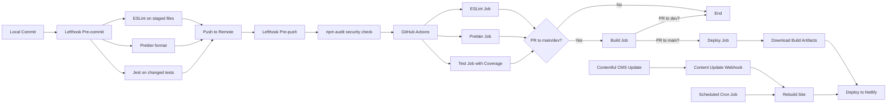

# TDW 1st Mini-Project

[](https://github.com/Dan1m4D/tdw-mp1-daniel-madureira/actions/workflows/pipeline.yml)


The objective of this first mini-project is to develop a CI/CD pipeline over a Next blog that consumes contents from Contentful CMS. The blog looks like the follow:


The project is organized as follows:

```bash
.
├── app
│   └── [components]
├── coverage
│   └── coverage-summary.json
├── env.example
├── eslint.config.mjs
├── jest.config.ts
├── jest.setup.ts
├── lefthook.yml
├── lib
│   └── [api related files]
├── next.config.js
├── next-env.d.ts
├── package.json
├── package-lock.json
├── postcss.config.js
├── readme_assets
│   └── [readme images]
├── README.md
├── tailwind.config.ts
├── __tests__
│   ├── components
│   ├── integration
│   ├── pages
│   ├── snapshots
│   ├── README.tests.md
│   └── test-jest.test.tsx
└── tsconfig.json

```

## Branches

For this project I'm using a **modified GitFlow** organization where I have the following branches:

- `main`: Default branch, protected. Holds the released, production ready code
- `dev`: Development branch, protected. Holds the tested, most updated and completed code.
- `hotfix`: Used to make quick fixes to the main or dev branch.
- `feature\**`: Feature branches. These branches are ulibsed to develop a (set of) feature(s) that when completed and tested are merged into the `dev` branch

The geral flow can be summarized by the following image (without the release branch):


## Pipeline overview

[](https://github.com/Dan1m4D/tdw-mp1-daniel-madureira/actions/workflows/pipeline.yml)


The CI/CD pipeline is implemented using GitHub Actions and follows industry best practices for performance, reliability, and efficiency.

### Pipeline Workflow



### Workflows

I developed 2 Github Actions workflows:

#### 1. **CI/CD Pipeline** (`pipeline.yml`)

Main development and deployment workflow triggered by pushes and pull requests.

| Job          | Description                                  | Runs On                | Timeout |
| ------------ | -------------------------------------------- | ---------------------- | ------- |
| **ESLint**   | Lints the code for errors and style issues   | All pushes & PRs       | 5 min   |
| **Prettier** | Checks code formatting consistency           | All pushes & PRs       | 5 min   |
| **Test**     | Runs Jest test suite with coverage reporting | All pushes & PRs       | 10 min  |
| **Build**    | Validates project builds successfully        | PRs to `main` or `dev` | 15 min  |
| **Deploy**   | Deploys to Netlify production                | PRs to `main` only     | 15 min  |

#### 2. **Content Update Workflow** (`update_content.yml`)

Webhook and schedule-triggered workflow for Contentful CMS integration.

| Trigger                | Description                                               | Actions                          |
| ---------------------- | --------------------------------------------------------- | -------------------------------- |
| **Contentful Webhook** | Triggered when content is published/updated in Contentful | Rebuild site → Deploy to Netlify |
| **Scheduled Cron Job** | Runs daily at midnight UTC (`0 0 * * *`)                  | Rebuild site → Deploy to Netlify |

This workflow enables automatic site redeployment through two mechanisms:

1. **Immediate updates**: When content editors publish or update content in Contentful CMS
2. **Scheduled rebuilds**: Daily automatic rebuilds to ensure content freshness and catch any missed webhook events

Both triggers ensure the production site always reflects the latest content without requiring developer intervention.

### Performance Optimizations

The pipeline includes several performance optimizations to reduce execution time and resource usage:

#### 1. **Dependency Caching**

- Uses `actions/setup-node@v4` with built-in npm caching
- Caches `node_modules` based on `package-lock.json` hash
- **Benefit**: 50-70% faster dependency installation on subsequent runs

#### 2. **Next.js Build Caching**

- Caches `.next/cache` directory for production builds
- Cache key based on dependencies and source code hashes
- **Benefit**: 30-50% faster build times with cache hits
- **Applied to**: Production builds (PRs to `main`) only

#### 3. **Build Artifact Sharing**

- Build artifacts (`.next` and `public` folders) are uploaded after production builds
- Deploy job downloads and reuses these artifacts instead of rebuilding
- **Benefit**: Eliminates redundant build step in deployment, ensures exact build is deployed

#### 4. **Concurrency Control**

- Automatically cancels in-progress runs when new commits are pushed to the same branch
- **Benefit**: Saves CI/CD minutes and avoids queue buildup

#### 5. **Optimized Commands**

- Uses `npm ci` instead of `npm install` for faster, more reliable installations
- **Benefit**: Clean installs based on lock file, better for CI environments

### Environment Strategy

The pipeline uses GitHub Environments for configuration management:

- **Development Environment**: Used for PRs to `dev` branch
  - Runs build validation only (no deployment)
  - Fresh builds without caching to catch issues early
- **Production Environment**: Used for PRs to `main` branch
  - Runs full build with caching and optimization
  - Uploads artifacts for deployment
  - Deploys to Netlify production

### Test Coverage Reporting

The test job includes automatic coverage reporting on pull requests:

- Generates coverage summary using Jest
- Posts coverage report as PR comment
- Includes badges, metrics, and file-level coverage details
- Only runs on pull requests to avoid unnecessary comments on push events

### Lefthook Integration

[Lefthook](https://github.com/evilmartians/lefthook) provides fast and powerful Git hooks management, running quality checks locally before code reaches the CI/CD pipeline.

#### Pre-commit Hooks (Parallel Execution)

Runs automatically before each commit:

```yaml
- ESLint: Lints staged files (*.js, *.ts, *.jsx, *.tsx)
- Prettier: Auto-formats code files
- Jest: Runs tests with coverage on changed test files
```

**Benefit**: Catches code quality issues immediately, before they're committed.

#### Pre-push Hooks

Runs before pushing to remote:

```yaml
- npm audit: Security vulnerability check (moderate level and above)
```

**Benefit**: Prevents pushing code with known security vulnerabilities.

#### Why Lefthook?

- **Fast**: Runs hooks in parallel when possible
- **Simple**: YAML configuration, no complex scripts
- **Reliable**: Written in Go, works across all platforms
- **Smart**: Only checks staged/changed files, not the entire codebase

This creates a **defense-in-depth** strategy:

1. **Local (Lefthook)**: Immediate feedback during development
2. **CI/CD (GitHub Actions)**: Comprehensive validation before merge/deploy

### Pipeline Conditions

- **Lint, Prettier, Test**: Run on all pushes and pull requests to any branch
- **Build**: Runs only on pull requests targeting `main` or `dev` branches
- **Deploy**: Runs only on pull requests targeting `main` branch (after successful build)
- **Content Update**: Runs on Contentful webhook events (content publish/update)

## Contentful configuration

The configuration setup for the **Contentful integration** with this project can be found in the original readme on the [original repository](https://github.com/TDW-2025/MP1) and the **demo** can be found [here](https://github.com/deca-ua/mp1-template-david/)

## Testing

### Overview

This project includes a comprehensive test suite made with Jest that holds **34 tests** across **12 test suites**, covering unit tests, integration tests, and snapshot tests. The test suite ensures code quality, prevents regressions, and validates both component behavior and visual consistency.

### Test Statistics

| Metric               | Value                          |
| -------------------- | ------------------------------ |
| **Total Tests**      | 34 passed                      |
| **Functional Tests** | 24 (unit + integration)        |
| **Snapshot Tests**   | 10 (visual regression)         |
| **Test Duration**    | ~3 seconds                     |
| **Coverage**         | Available via coverage reports |

### Test Structure

```bash
__tests__/
├── components/              # Component unit tests
│   ├── avatar.test.tsx
│   ├── cover-image.test.tsx
│   ├── date.test.tsx
│   ├── layout.test.tsx
│   └── more-stories.test.tsx
├── pages/                   # Page-level testsmd
│   ├── home-page.test.tsx
│   └── app-page.test.tsx
├── integration/             # Integration tests
│   ├── component-integration.test.tsx
│   └── page-flow.test.tsx
└── snapshots/               # Snapshot tests
    ├── component-snapshots.test.tsx
    └── page-snapshots.test.tsx
```

### Test Categories

1. **Component Unit Tests (15)**: Individual component testing (Avatar, Date, CoverImage, MoreStories, Layout)
2. **Page Tests (7)**: Next.js server components and page rendering (Home, Post Detail pages)
3. **Integration Tests (6)**: Component interactions, page flows, and API integration
4. **Snapshot Tests (10)**: Visual regression testing for components and pages

### Running Tests

```bash
# Run all tests
npm test

# Run tests in watch mode
npm run test:watch

# Run tests with coverage report
npm run test:coverage

# Update snapshots (after intentional UI changes)
npm test -- -u
```

For detailed test documentation, including all test cases and mocking patterns, see [the test suit docs](__tests__/README.tests.md).
