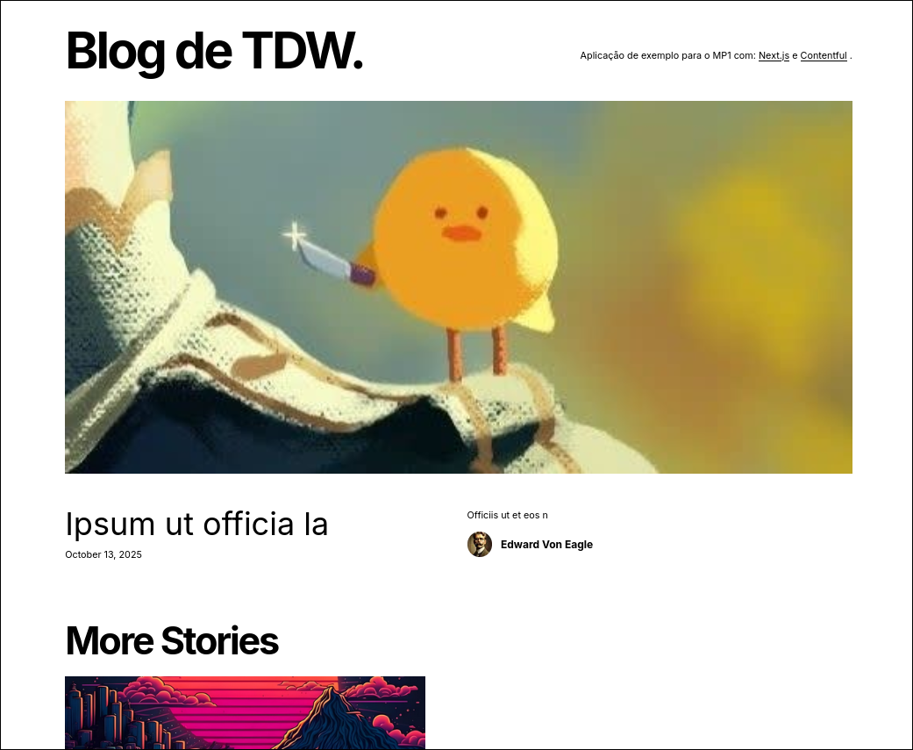

# TDW 1st Mini-Project

[](https://github.com/Dan1m4D/tdw-mp1-daniel-madureira/actions/workflows/pipeline.yml)

The objective of this first mini-project is to develop a CI/CD pipeline over a Next blog that consumes contents from Contentful CMS. The blog looks like the follow:



The project is organized as follows:

```bash
.
├── app
│   └── [components]
├── env.example
├── eslint.config.mjs
├── lefthook.yml
├── lib
│   └── [api related files]
├── next.config.js
├── next-env.d.ts
├── package.json
├── package-lock.json
├── postcss.config.js
├── readme_assets
│   └── image.png
├── README.md
├── tailwind.config.ts
└── tsconfig.json
```

## Branches

For this project I'm using a **modified GitFlow** organization where I have the following branches:

- `main`: Default branch, protected. Holds the released, production ready code
- `dev`: Development branch, protected. Holds the tested, most updated and completed code.
- `hotfix`: Used to make quick fixes to the main or dev branch.
- `feature\**`: Feature branches. These branches are used to develop a (set of) feature(s) that when completed and tested are merged into the `dev` branch

The geral flow can be summarized by the following image (without the release branch):


## Pipeline overview

[](https://github.com/Dan1m4D/tdw-mp1-daniel-madureira/actions/workflows/pipeline.yml)
#todo

```node
lefthook(lint + prettier) -> commit -> lefthook (package audit) -> eslint job
                                                                -> prettier job
```

## Contentful configuration

The configuration setup for the **Contentful integration** with this project can be found in the original readme on the [original repository](https://github.com/TDW-2025/MP1) and the **demo** can be found [here](https://github.com/deca-ua/mp1-template-david/)
